=============================
Django Admin Toolkit
=============================

.. image:: https://badge.fury.io/py/django-admin-toolkit.svg/?style=flat-square
    :target: https://badge.fury.io/py/django-admin-toolkit

.. image:: https://readthedocs.org/projects/pip/badge/?version=latest&style=flat-square
    :target: https://django-admin-toolkit.readthedocs.io/en/latest/

.. image:: https://img.shields.io/coveralls/github/frankhood/django-admin-toolkit/master?style=flat-square
    :target: https://coveralls.io/github/frankhood/django-admin-toolkit?branch=master
    :alt: Coverage Status

This package offers a wide choice of admin mixins to best customize your Django admin site,
with a multitude of useful features that will simplify your development.

Documentation
-------------

The full documentation is at https://django-admin-toolkit.readthedocs.io.

Quickstart
----------

Install Django Admin Toolkit::

    pip install django-admin-toolkit

Add it to your ``INSTALLED_APPS``:

.. code-block:: python

    INSTALLED_APPS = (
        ...
        'admin_toolkit',
        ...
    )

AfterSaveAdminMixin
_________________________

Through this mixin it is possible to insert your own logics at the end of saving the model via Django admin site.

.. code-block:: python

    from admin_toolkit.admin_mixins import AfterSaveAdminMixin

    @admin.register(app_models.AfterSaveExampleModel)
    class AfterSaveExampleModelAdmin(AfterSaveAdminMixin, admin.ModelAdmin):
        list_display = ("__str__", "test_text")
        fields = ("test_text",)

AllReadonlyAdminMixin
_____________________

This admin mixin will turn all your admin fields into read only fields.

.. code-block:: python

    from admin_toolkit.admin_mixins import AllReadonlyAdminMixin

    @admin.register(app_models.AllReadonlyExampleModel)
    class AllReadonlyExampleModelAdmin(AllReadonlyAdminMixin, admin.ModelAdmin):
        list_display = ("id", "test_text",)
        fields = ("test_text",)

In the image you can see that there is no permission to add other objects because in the mixin ``has_add_permission()`` returns False.

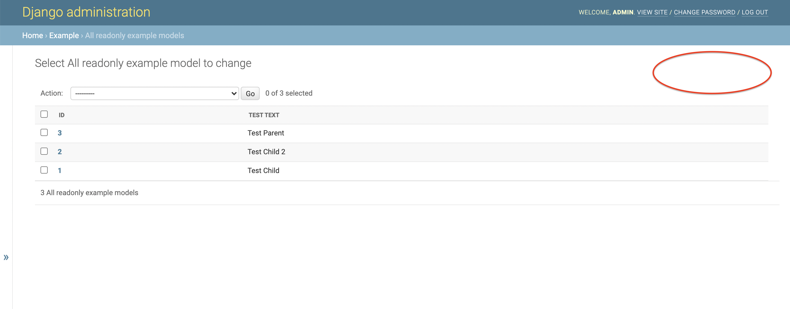

And in the detail page it is possible to see that all the fields present are readonly.

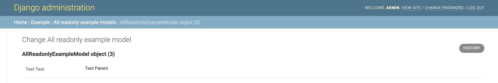

AllReadonlyAdminInlineMixin
___________________________

This admin mixin will turn all your inline admin fields into read only fields.

.. code-block:: python

    from admin_toolkit.admin_mixins import AllReadonlyAdminInlineMixin

    class AllReadonlyExampleModelAdminInline(AllReadonlyAdminInlineMixin, admin.TabularInline):
        model = app_models.AllReadonlyExampleModel
        fields = ("test_text",)

In the image you can see that there is no permission to add other objects in inline because in the mixin ``has_add_permission()`` returns False.
And it is possible to see that all the fields present are readonly.

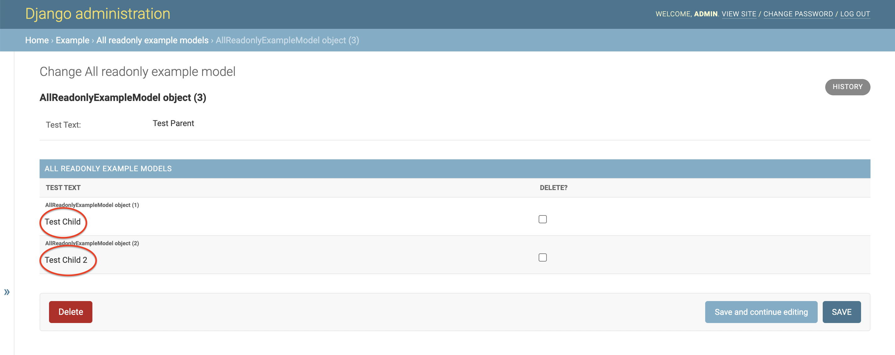

BaseAdminMixin
______________

This mixin provides a wide variety of display methods for all (or almost all)
of the readonly fields that you will need to display in your Django admin site.

Create your model and add the ``admin_changelist_url()`` method and the ``get_ct()`` method to it.

.. code-block:: python

    class BaseExampleModel(models.Model):
        objects = app_managers.BaseExampleModelManager.from_queryset(app_queryset.BaseExampleModelQuerySet)()

        test_boolean = models.BooleanField(
            "Test bool",
            null=True
        )
        test_datetime = models.DateTimeField(
            "Test datetime"
        )
        test_fk = models.ForeignKey(
            "example.BaseExampleFkModel",
            verbose_name="Test fk",
            on_delete=models.CASCADE,
            related_name="example_for_base_admin_mixins"
        )
        test_image = models.ImageField(
            "Test image",
            upload_to="example/images/"
        )
        test_m2m = models.ManyToManyField(
            "example.BaseExampleM2MModel",
            related_name="example_for_base_admin_mixins",
        )
        example_generic_relation_model_for_base_admin_mixin = GenericRelation(
            "example.BaseExampleGenericRelationModel",
            related_query_name='example_model_for_base_admin_mixin'
        )

        def __str__(self):
            return str(self.id)

        @classmethod
        def admin_changelist_url(cls):
            return reverse("admin:example_baseexamplemodel_changelist")

        def get_ct(self):
            return ContentType.objects.get(
                app_label=self._meta.app_label, model=self._meta.model_name
            )

Then register ``BaseExampleModel`` and start to add all yours displays.

.. code-block:: python

    from admin_toolkit.admin_mixins import BaseAdminMixin

    @admin.register(app_models.BaseExampleModel)
    class BaseExampleModelAdmin(BaseAdminMixin, admin.ModelAdmin):
        list_display = (
            "__str__",
            "display_test_boolean",
            "display_test_datetime",
            "display_test_date",
            "display_test_time",
            "display_test_fk",
            "display_test_image",
            "display_test_m2m",
        )
        fields = ("test_boolean", "test_datetime", "test_fk", "test_image", "test_m2m")
        readonly_fields = (
            "display_test_boolean",
            "display_test_datetime",
            "display_test_date",
            "display_test_time",
            "display_test_fk",
            "display_test_image",
            "display_test_m2m",
            "display_generic_relation",
        )

#. How to display a boolean field:

    .. code-block:: python

        @mark_safe
        def display_test_boolean(self, obj):
            if obj and obj.test_boolean:
                return self._display_boolean(obj.test_boolean)
            return ""

    .. image:: docs/readme_images/base_example_boolean.png
        :alt: BaseAdminMixin boolean field Image.

#. How to display a datetime (work only with datetime):

    .. code-block:: python

        @mark_safe
        def display_test_datetime(self, obj):
            if obj and obj.test_datetime:
                return self._display_datetime(obj.test_datetime)
            return ""

    .. image:: docs/readme_images/base_example_datetime.png
        :alt: BaseAdminMixin datetime field Image.

#. How to display a date (work only with datetime):

    .. code-block:: python

        @mark_safe
        def display_test_date(self, obj):
            if obj and obj.test_datetime:
                return self._display_date(obj.test_datetime)
            return ""

    .. image:: docs/readme_images/base_example_date.png
        :alt: BaseAdminMixin date field Image.

#. How to display a time (work only with datetime):

    .. code-block:: python

        @mark_safe
        def display_test_time(self, obj):
            if obj and obj.test_datetime:
                return self._display_time(obj.test_datetime)
            return ""

    .. image:: docs/readme_images/base_example_time.png
        :alt: BaseAdminMixin time field Image.

#. How to display a ForeignKey:

    .. code-block:: python

        @mark_safe
        def display_test_fk(self, obj):
            if obj and obj.test_fk:
                return self._display_fk_object(obj.test_fk)
            return ""

    .. image:: docs/readme_images/base_example_fk.png
        :alt: BaseAdminMixin FK field Image.

#. How to display an image:

    .. code-block:: python

        @mark_safe
        def display_test_image(self, obj):
            if obj and obj.test_image:
                return self._display_image(obj.test_image)
            return ""

    .. image:: docs/readme_images/base_example_image.png
        :alt: BaseAdminMixin image field Image.

#. How to display a ManyToMany:

    .. code-block:: python

        @mark_safe
        def display_test_m2m(self, obj):
            if obj and obj.test_m2m:
                return self._display_m2m_objects(
                    obj, m2m_field_name="test_m2m", label="Example M2Ms"
                )
            return ""

    .. image:: docs/readme_images/base_example_m2m.png
        :alt: BaseAdminMixin image field Image.

#. How to display a GenericRelation:

    .. code-block:: python

        @mark_safe
        def display_generic_relation(self, obj):
            if obj and obj.id:
                return self._display_generic_related_objects(
                    obj,
                    "example_generic_relation_model_for_base_admin_mixin",
                    "Example Generic Relations"
                )
            return ""

    .. image:: docs/readme_images/base_example_generic_relation.png
        :alt: BaseAdminMixin generic relation field Image.

This is the final changelist result:

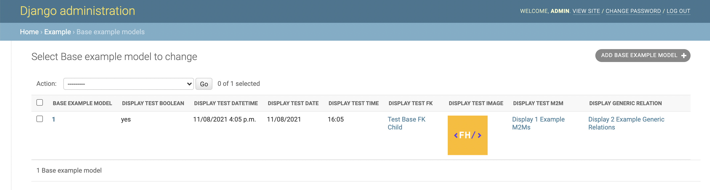

ConfigurableWidgetsAdminMixin
_____________________________

Use ConfigurableWidgetsMixinAdmin if you want to customize quickly
default widget/label/help_text or every related admin form configurations
without doing modifications of the auto created ModelForm.

In this example I am going to modify the help_text and the widgets of the three fields.

.. code-block:: python

    # ==================
    # project/models.py
    # ==================

    class ConfigurableWidgetsExampleModel(models.Model):
        objects = ConfigurableWidgetsExampleModelManager.from_queryset(
            ConfigurableWidgetsExampleModelQuerySet)()

        test_text = models.CharField("Test Text", max_length=500, default="", blank=True)
        test_fk = models.ForeignKey(
            ConfigurableWidgetsExampleFKModel,
            verbose_name="Test FK",
            on_delete=models.SET_NULL,
            null=True
        )
        test_m2m = models.ManyToManyField(
            ConfigurableWidgetsExampleM2MModel,
            verbose_name="Test M2M"
        )

        class Meta:
            verbose_name = "Configurable widgets example model"
            verbose_name_plural = "Configurable widgets example models"

    # ==================
    # project/admin.py
    # ==================
    from admin_toolkit.admin_mixins import ConfigurableWidgetsAdminMixin

    @admin.register(app_models.ConfigurableWidgetsExampleModel)
    class ConfigurableWidgetsExampleModelAdmin(ConfigurableWidgetsAdminMixin, admin.ModelAdmin):
        list_display = ("id", "test_text",)
        fieldsets = (
            (None, {"fields": (
                ("test_text",),
                ("test_fk", "test_m2m",),
            )}),
        )
        filter_horizontal = ("test_m2m",)
        dbfield_overrides = {
            "test_text": {"help_text": "Test Text Example help text", "widget": forms.Textarea},
        }
        fkfield_overrides = {
            "test_fk": {"help_text": "Test FK Example help text", "widget": forms.RadioSelect},
        }
        m2mfield_overrides = {
            "test_m2m": {"help_text": "Test M2M Example help text", "widget": forms.CheckboxSelectMultiple}
        }

This is the final result:

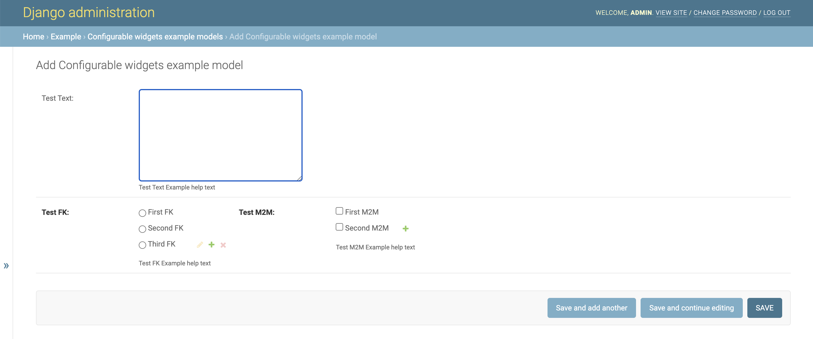

DetailInInlineAdminMixin
________________________

This admin mixin allows you to have in each line of the inline a button that redirects to the change form of the element created.

.. code-block:: python

    from admin_toolkit.admin_mixins import DetailInInlineAdminMixin

    class DetailInInlineExampleModelAdminInline(DetailInInlineAdminMixin, admin.TabularInline):
        fields = ("test_text",)
        model = app_models.DetailInInlineExampleModel

This is the final result:

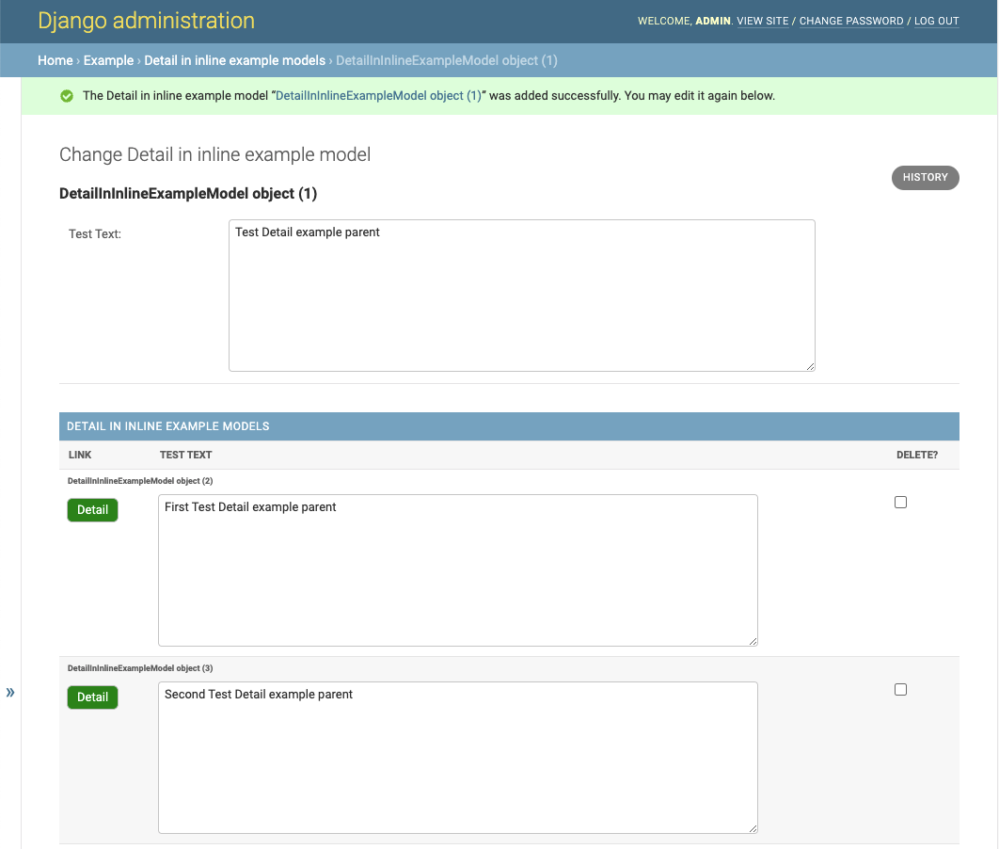

EmptyValueAdminMixin
____________________

This admin mixin allows you to define a label for a foreign key field for the empty value.

.. code-block:: python

    @admin.register(app_models.EmptyValueExampleModel)
    class EmptyValueExampleModelAdmin(EmptyValueAdminMixin, admin.ModelAdmin):
        list_display = ("id", "test_text", "test_fk",)
        fields = ("test_text", "test_fk")
        empty_values = {
            "test_fk": _("NO TEST FK")
        }

This is the final result:

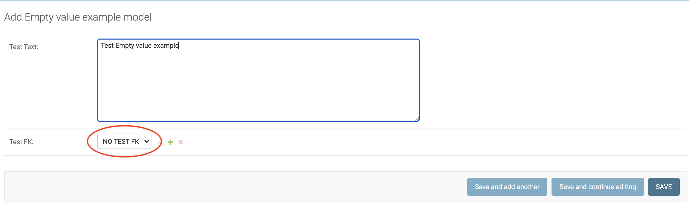

ExtraButtonAdminMixin
_____________________

This admin mixin allows you to add extra buttons links next to the add button in a simple and immediate way.

.. code-block:: python

    @admin.register(app_models.ExtraButtonExampleModel)
    class ExtraButtonExampleModelAdmin(ExtraButtonAdminMixin, admin.ModelAdmin):
        list_display = ("id", "test_text")
        fields = ("test_text",)
        extra_button = [
            {
                "label": "Example Extra Button",
                "url": "http://example.com",
                "class": ""
            }
        ]

This is the final result:

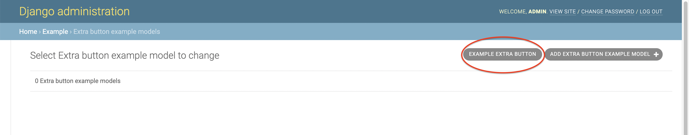

FloatingAdminMixin
__________________

This mixin makes the list filters collapsible vertically
in such a way as to have more space for any columns that otherwise would not be seen.

.. code-block:: python

    @admin.register(app_models.FloatingExampleModel)
    class FloatingExampleModelAdmin(FloatingAdminMixin, admin.ModelAdmin):
        list_display = ("id", "test_text")
        list_filter = ("test_text",)
        fields = ("test_text",)

This is the final result:

#. When the list filter is collapsed.
    .. image:: docs/readme_images/floating_changelist_collapsed.png
        :alt: Floating admin mixin collapsed in changelist Image.

#. When the list filter is decollapsed.
    .. image:: docs/readme_images/floating_changelist_decollapsed.png
        :alt: Floating admin mixin decollapsed in changelist Image.

ImprovedRawIdFieldsAdminMixin
_____________________________

This admin mixin allows you to view the link of the changelist/changeform
of the selected objects inside the raw_id_field on ForeignKey and ManyToMany.

.. code-block:: python

    @admin.register(app_models.ImprovedRawIdFieldsExampleModel)
    class ImprovedRawIdFieldsExampleModelAdmin(ImprovedRawIdFieldsAdminMixin, admin.ModelAdmin):
        improved_raw_id_fields = ["test_fk", "test_m2m"]
        list_display = ("id", "test_name",)
        fieldsets = (
            (None, {"fields": (
                ("test_name",),
                ("test_fk", "test_m2m"),
            )}),
        )

This is the result:

#. When adding an object.
    .. image:: docs/readme_images/improve_raw_fields_changeform_add.png
        :alt: Improve Raw Id Fields admin mixin in changeform add Image.

#. When changing an object.
    .. image:: docs/readme_images/improve_raw_fields_changeform_change.png
        :alt: Improve Raw Id Fields admin mixin in changeform change Image.

ADMIN FILTERS
_____________
This package also comes with a set of list filters
that you can use to make it easier to write filters with special queries.

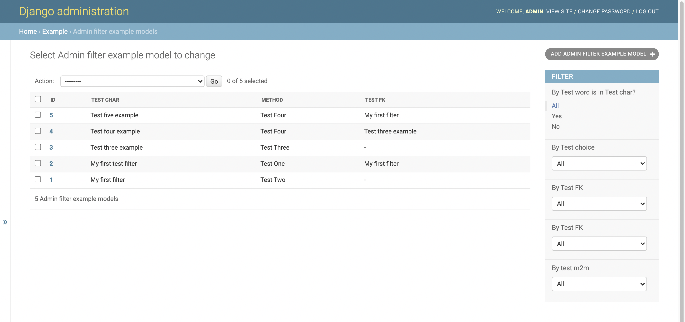

CustomRelatedSelectFilter
=========================
Using this filter on Many to Many or Foreign Key it is possible
to have a list of elements associated with the field inserted in the list_filter
which becomes a select if the list exceeds 4 elements ordered according to a specific
field of the foreign key or many to many.

.. code-block:: python

    class CustomRelatedSelectFilterForTestFK(admin_filters.CustomRelatedSelectFilter):

        def get_related_order(self):
            return ["test_char"]

    class CustomRelatedSelectFilterForTestM2M(admin_filters.CustomRelatedSelectFilter):

        def get_related_order(self):
            return ["test_char"]

    @admin.register(app_models.AdminFilterExampleModel)
    class AdminFilterExampleModelAdmin(admin.ModelAdmin):
        list_display = ("id", "test_char", "get_test_choice_display", "test_fk")
        list_filter = (
            ("test_fk", CustomRelatedSelectFilterForTestFK),
            ("test_m2m", CustomRelatedSelectFilterForTestM2M),
        )
        fieldsets = (
            (None, {"fields": (
                ("test_char", "test_choice", "test_fk", "test_m2m"),
            )}),
        )

This are the results:

* For the field test_fk:

    .. image:: docs/readme_images/admin_custom_related_filter_fk.png
        :alt: Admin custom related filter for FK

* For the field test_m2m:

    .. image:: docs/readme_images/admin_custom_related_filter_m2m.png
        :alt: Admin custom related filter for M2M

RelatedSelectFilter
===================
Using this filter on Many to Many or Foreign Key it is possible
to have a list of elements associated with the field inserted in the list_filter
which becomes a select if the list exceeds 4 elements.

.. code-block:: python

    @admin.register(app_models.AdminFilterExampleModel)
    class AdminFilterExampleModelAdmin(admin.ModelAdmin):
        list_display = ("id", "test_char", "get_test_choice_display", "test_fk")
        list_filter = (
            ("test_fk", RelatedSelectFilter),
        )
        fieldsets = (
            (None, {"fields": (
                ("test_char", "test_choice", "test_fk", "test_m2m"),
            )}),
        )

SelectFilter
============
This filter can be used on fields that contain choices to be able to display them in a select instead of seeing a bulleted list.

.. code-block:: python

    @admin.register(app_models.AdminFilterExampleModel)
    class AdminFilterExampleModelAdmin(admin.ModelAdmin):
        list_display = ("id", "test_char", "get_test_choice_display", "test_fk")
        list_filter = (
            ("test_choice", SelectFilter),
        )
        fieldsets = (
            (None, {"fields": (
                ("test_char", "test_choice", "test_fk", "test_m2m"),
            )}),
        )

This is the result:

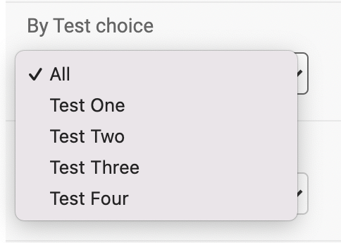

SimpleBooleanListFilter
=======================
This filter can be used to give a given query a boolean filter like this example:

.. code-block:: python

    # tests/example/admin_filters.py

    class SimpleBooleanTestInTestCharFilter(admin_filters.SimpleBooleanListFilter):
        title = "Test word is in Test char?"
        parameter_name = "test_char"

        def get_true_queryset_values(self, queryset):
            return queryset.filter(test_char__icontains="test")

        def get_false_queryset_values(self, queryset):
            return queryset.exclude(test_char__icontains="test")

    # tests/example/admin.py

    from tests.example import admin_filters as app_admin_filters

    @admin.register(app_models.AdminFilterExampleModel)
    class AdminFilterExampleModelAdmin(admin.ModelAdmin):
        list_display = ("id", "test_char", "get_test_choice_display", "test_fk")
        list_filter = (
            app_admin_filters.SimpleBooleanTestInTestCharFilter,
        )
        fieldsets = (
            (None, {"fields": (
                ("test_char", "test_choice", "test_fk", "test_m2m"),
            )}),
        )

This is the result:

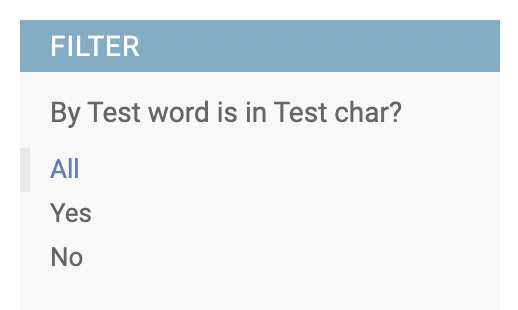

Running Tests
-------------

Does the code actually work?

::

    source <YOURVIRTUALENV>/bin/activate
    (myenv) $ pip install tox
    (myenv) $ tox

Development commands
---------------------

::

    pip install -r requirements_dev.txt
    invoke -l

Credits
-------

Tools used in rendering this package:

*  Cookiecutter_
*  `cookiecutter-djangopackage`_

.. _Cookiecutter: https://github.com/audreyr/cookiecutter
.. _`cookiecutter-djangopackage`: https://github.com/pydanny/cookiecutter-djangopackage
